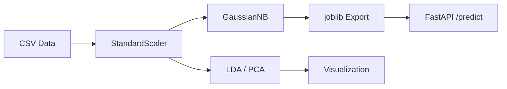

# Naive Bayes & LDA: Generative Classifiers

## Overview

Gaussian Naive Bayes and Linear Discriminant Analysis (LDA) for multi-class classification — two fast, interpretable generative models that learn the probability distribution of each class. Two real-world datasets: Jira bug ticket routing (88.6% accuracy) and silicon defect classification (99.9% accuracy).

| Concept | Description |
|---|---|
| **Naive Bayes** | Classifies by computing P(class\|features) using Bayes' theorem with independence assumption |
| **Gaussian NB** | Assumes each feature follows a Gaussian distribution per class |
| **LDA** | Finds linear combinations of features that best separate classes |
| **Prior** | P(class) — how common each class is before seeing any features |
| **Likelihood** | P(features\|class) — how likely the features are given the class |
| **Posterior** | P(class\|features) — the final classification probability |

## Datasets

| Dataset | Rows | Features | Target | Classes |
|---|---|---|---|---|
| Jira Bug Routing | 8,000 | 6 numeric | category | 6 (Hardware, Firmware, Software, Performance, Security, Docs) |
| Silicon Defect Classification | 6,000 | 5 numeric | defect_type | 7 (6 defect types + Clean Die) |

## Results

| Model | Dataset | Accuracy |
|---|---|---|
| GaussianNB | Jira Bug Routing | **88.6%** |
| GaussianNB | Silicon Defect | **99.9%** |

## Quick Start

```bash
git clone https://github.com/AIML-Engineering-Lab/008_naive_bayes_lda.git
cd 008_naive_bayes_lda
pip install -r requirements.txt
python src/train.py          # Train both models
python src/predict.py        # Run predictions
python tests/test_model.py   # Run tests
uvicorn src.api:app          # Launch API
jupyter notebook notebooks/  # Explore notebooks
```

## Project Structure

```
008_naive_bayes_lda/
├── assets/
│   ├── proj1_jira_3d_lda.png
│   ├── proj1_jira_3d_nb_probability.png
│   ├── proj1_jira_bayes_theorem.png
│   ├── proj1_jira_confusion.png
│   ├── proj1_jira_decision_boundaries.png
│   ├── proj1_jira_eda.png
│   ├── proj1_jira_flowchart.png
│   ├── proj1_jira_lda_vs_pca.png
│   ├── proj1_jira_lda_vs_pca_comparison.png
│   ├── proj1_jira_model_heatmap.png
│   ├── proj1_jira_nb_distributions.png
│   ├── proj2_silicon_3d_defects.png
│   ├── proj2_silicon_confusion.png
│   ├── proj2_silicon_confusion_matrices.png
│   ├── proj2_silicon_eda.png
│   ├── proj2_silicon_flowchart.png
│   └── proj2_silicon_lda_vs_pca.png
├── data/
│   ├── jira_bug_routing.csv
│   └── silicon_defect_classification.csv
├── deploy/
│   ├── Dockerfile
│   └── docker-compose.yml
├── docs/
│   ├── Naive_Bayes_LDA_Report.html
│   └── Naive_Bayes_LDA_Report.pdf
├── models/
│   ├── gnb_jira.pkl
│   └── gnb_silicon.pkl
├── notebooks/
│   ├── 01_naive_bayes_jira.ipynb
│   └── 02_naive_bayes_silicon_defect.ipynb
├── src/
│   ├── api.py
│   ├── predict.py
│   └── train.py
├── tests/
│   └── test_model.py
├── .gitignore
├── LICENSE
├── README.md
└── requirements.txt
```

## Architecture



## License

MIT
